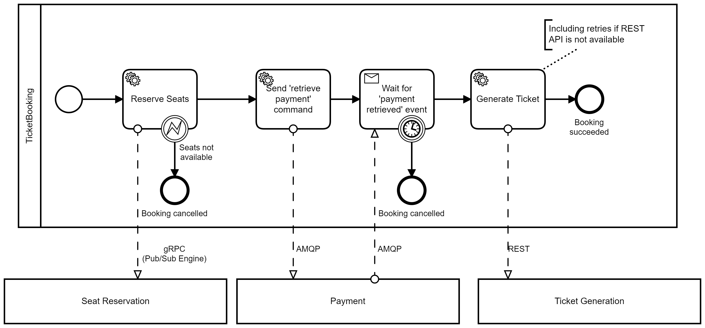
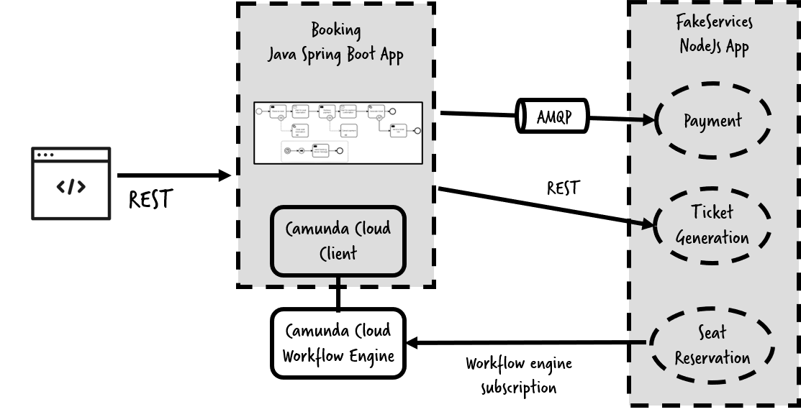
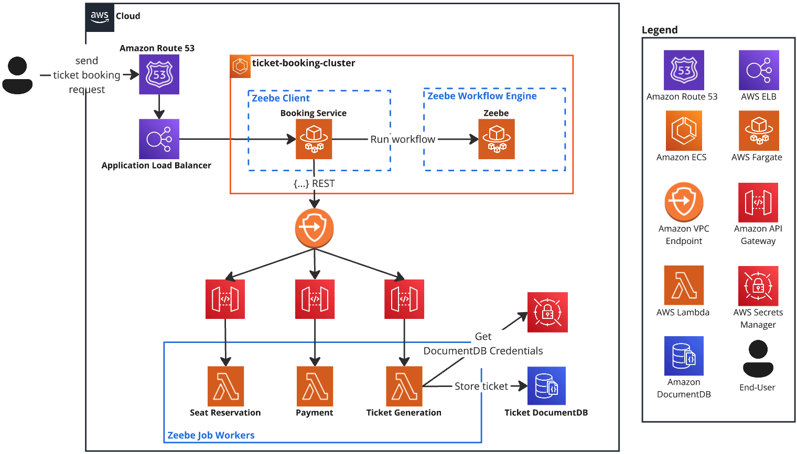

# 🚀 Cloud Migration Project of a Camunda Ticket Booking System

This project demonstrates the migration of a **Camunda Ticket Booking System** to the cloud, leveraging AWS services for scalability, security, and high availability.

## 🎟️ Camunda Ticket Booking System (Before Migration)




### 🛠️ Technology Stack (Pre-Migration)
- **Camunda Platform 8**
- **RabbitMQ**
- **Java Spring Boot Application**
- **Node.js Application**

For reference, you can check out the original Camunda Ticket Booking example repository [here](https://github.com/berndruecker/ticket-booking-camunda-8).

---

## ☁️ Cloud-based Ticket Booking System (After Migration)



### 🏗️ Technology Stack (Post-Migration)
- **Amazon Route 53** (Domain & DNS Management)
- **AWS Elastic Load Balancer** (Traffic Distribution)
- **Amazon Elastic Container Service (ECS)** (Container Orchestration)
- **AWS Fargate** (Serverless Compute for Java Booking Service + Zeebe Workflow Engine)
- **Amazon VPC Endpoint** (Private Connectivity)
- **Amazon API Gateway** (API Management)
- **AWS Lambda** (Serverless functions for Seat Reservation, Payment, and Ticket Generation – Node.js)
- **AWS Secrets Manager** (Secure Credential Storage for DocumentDB)
- **Amazon DocumentDB** (Managed NoSQL Database)

---

## 📌 Deployment Order of the Stacks

To ensure proper inter-service communication, stacks export necessary values for dependent stacks. Therefore, the **deployment must follow this specific order**:

1. **DocumentDB** (Database Layer)
2. **VPC Endpoint** (Network Connectivity)
3. **Seat Reservation Lambda**, **Payment Receiver Lambda**, & **Ticket Generator Lambda** (Zeebe Job Workers as Serverless Functions)
4. **Ticket Booking ECS Cluster** (Ticket Booking System Cluster)
5. **Zeebe** (Zeebe Workflow Engine as a Fargate Task)
6. **Booking Service** (Zeebe Client as a Fargate Task)

---

## 🔒 Security & Access Control

- **Private Subnets:** All services, except the **Application Load Balancer (ALB)**, are deployed within private subnets for enhanced security.
- **Least Privilege Access:** Each resource has **dedicated security groups**, ensuring only necessary access between interconnected services.
- **No Direct Public Access:** Resources are **not exposed** to public IPs, enforcing strict security compliance.

---

## ✅ Testing the System

📌 Basic Ticket Booking Request
```
curl -i -X PUT http://<booking-service-endpoint>/ticket
```

📌 Simulate failures by:

```
curl -i -X PUT http://<booking-service-endpoint>/ticket?simulateBookingFailure=seats
curl -i -X PUT http://<booking-service-endpoint>/ticket?simulateBookingFailure=payment
curl -i -X PUT http://<booking-service-endpoint>/ticket?simulateBookingFailure=ticket
```
